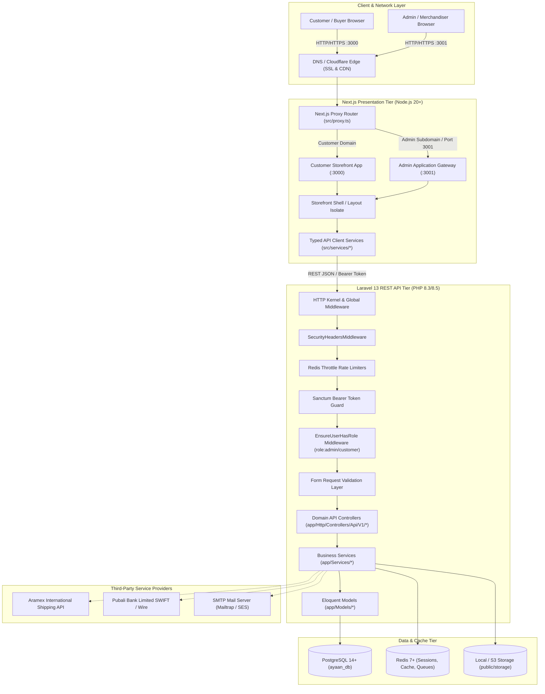
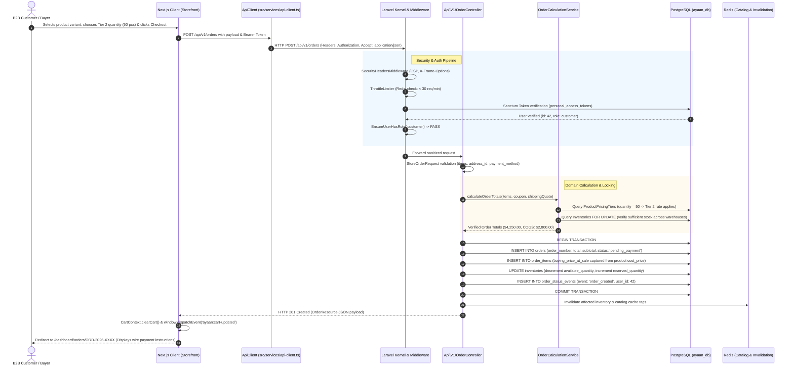

# 02 — System Architecture & Request Lifecycle

## 1. High-Level Architectural Blueprint

The Ayaan Clothing platform is structured as a decoupled, multi-tier client-server architecture. The presentation layer is powered by **Next.js (React 19 / App Router)**, the application logic and business rules are handled by a **Laravel 13 REST API**, and persistence is maintained in **PostgreSQL** alongside an in-memory **Redis** cluster for caching, sessions, and asynchronous job processing.



---

## 2. Tier-by-Tier Architectural Breakdown

### Tier 1: Presentation & Gateway Layer (Next.js 16.3.2)
- **Runtime**: Node.js 20+ with Next.js Turbopack compiler.
- **Port Allocation**:
  - `3000`: Dedicated Customer Storefront (`NEXT_PUBLIC_CUSTOMER_APP_URL`).
  - `3001`: Dedicated Admin Management Portal (`NEXT_PUBLIC_ADMIN_APP_URL`) via `scripts/admin-proxy.js`.
- **Routing Engine**:
  - Next.js 16 Proxy Middleware (`src/proxy.ts`) inspects incoming `Host`, `x-admin-app`, or port parameters.
  - If a visitor accesses `/admin` from the customer domain (`:3000`), the proxy issues a 307 temporary redirect to the dedicated admin origin (`:3001`).
  - If a visitor accesses `/` or `/admin/*` on port `3001`, the proxy rewrites the path directly to internal admin route handlers while injecting `x-is-admin-host: 1`.
- **Shell Isolation (`src/components/layout/StorefrontShell.tsx`)**:
  - Automatically suppresses customer headers, search bars, cart drawers, and promotional carousels when rendering on admin routes.
  - Ensures administrative workflows remain 100% decoupled from retail/consumer browsing UI.

### Tier 2: API & Application Logic Layer (Laravel 13.x)
- **Runtime**: PHP 8.3 / 8.5 executing on Nginx / PHP-FPM or local `artisan serve` on port `8000`.
- **API Prefix**: All public and private API routes are grouped under `/api/v1/`.
- **Middleware Pipeline**:
  1. `SecurityHeadersMiddleware`: Injects strict CSP, `X-Frame-Options: SAMEORIGIN`, `X-Content-Type-Options: nosniff`, and `Referrer-Policy`.
  2. `throttle:api`: Dynamic rate limiting backed by Redis. Specific routes enforce tight limiters (e.g., `auth-login` 5 req/min, `rfq-create` 10 req/min).
  3. `auth:sanctum`: Verifies state-less Bearer token against the `personal_access_tokens` table.
  4. `role:admin` / `role:customer` (`EnsureUserHasRole`): Strictly validates token holder's role in the `users` table.

### Tier 3: Business Services & Domain Logic
Rather than stuffing database queries into controllers, business operations are delegated to dedicated service classes:
- **`OrderCalculationService`**: Executes 3-tier price lookups, applies volume tier breaks, checks full-stock eligibility, and calculates tax/shipping totals.
- **`CatalogCacheService`**: Manages tagged Redis caching for catalog payloads and dispatches atomic cache eviction on mutations.
- **`SalesProfitAnalyticsService`**: Calculates real-time COGS by multiplying ordered quantities by `buying_price_at_sale` captured at checkout time.
- **`PackageCalculatorService`**: Computes total volumetric CBM, carton counts, and container load factors based on size matrices.
- **`AramexShippingService`**: Generates real-time rate quotes and registers international air waybills.

### Tier 4: Relational Persistence Layer (PostgreSQL 14+)
- **Primary Database**: `ayaan_db` on port `5432`.
- **Data Integrity**: 49 migrations enforce strict foreign key constraints, `ON DELETE RESTRICT` or `ON DELETE CASCADE` where appropriate, compound unique indexes, and audit timestamps.
- **Zero Orphan Guarantee**: Critical relationships (Order Items → Products, Inventories → Warehouses, Product Images → Products) cannot be silently corrupted by admin deletions.

### Tier 5: In-Memory & Caching Layer (Redis 7+)
- **Predis Client**: Configured via `REDIS_CLIENT=predis`.
- **Database Partitioning**:
  - `DB 0`: Queue workers and general cache.
  - `DB 1`: Tagged catalog cache (`ayaan_cache_catalog`, `ayaan_cache_homepage`, `ayaan_cache_brands`).
  - `DB 2`: Session driver and API throttle keys.

---

## 3. End-to-End Primary Request Lifecycle

The diagram below outlines the exact lifecycle of a typical authenticated wholesale transaction (e.g., submitting an RFQ or Placing a Wholesale Order):



---

## 4. Alternative Lifecycles & Error Handling Flows

### 4.1 Admin Catalog Merchandising Update (Instant Sync Flow)
1. **Admin Action**: Merchandiser marks Brand *Nike* as `is_featured_on_landing = true` and saves landing order `1` in `/admin/homepage`.
2. **API Mutation**: `POST /api/v1/admin/homepage/featured-brands` hits `AdminHomepageManagementController::syncFeaturedBrands()`.
3. **Database Sync**: The controller executes a PostgreSQL transaction:
   - Synchronizes `homepage_featured_brands` pivot records.
   - Updates `brands.is_featured_on_landing` and `brands.landing_sort_order`.
4. **Cache Flush**: `CatalogCacheService::forgetHomepage()` invalidates Redis cache keys tagged with `homepage` and `brands`.
5. **Client Notification**: The admin response returns HTTP 200. The admin frontend dispatches custom browser events `ayaan:homepage-updated` and `ayaan:data-updated`.
6. **Storefront Auto-Refresh**: Storefront components (`ShopByBrand.tsx`, `HotSales.tsx`) listening to these events immediately trigger a background re-fetch without requiring the user to hard-refresh their browser.

### 4.2 Network or Database Unavailability Flow
1. If the PostgreSQL database daemon or Laravel server fails, `src/services/api-client.ts` intercepts the fetch rejection.
2. The client intercepts status `0` / network failure and wraps it into a typed `ApiError` structure:
   ```typescript
   {
     status: 0,
     message: "Backend unreachable or network failure (GET http://127.0.0.1:8000/api/v1/homepage): fetch failed",
     data: { originalError: "fetch failed", url: "http://127.0.0.1:8000/api/v1/homepage", method: "GET" }
   }
   ```
3. Rather than silently falling back to fake/mock catalog data, the UI renders a clean contextual error banner or graceful empty state (`ShopByBrand` renders zero tiles, `HotSales` suppresses the carousel).
