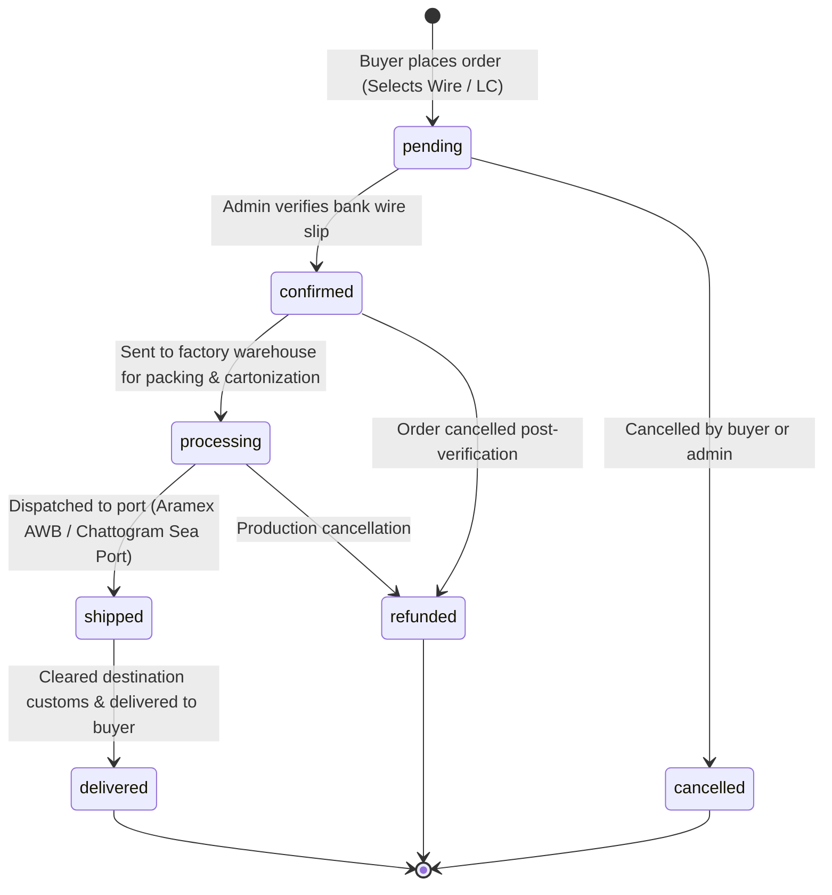
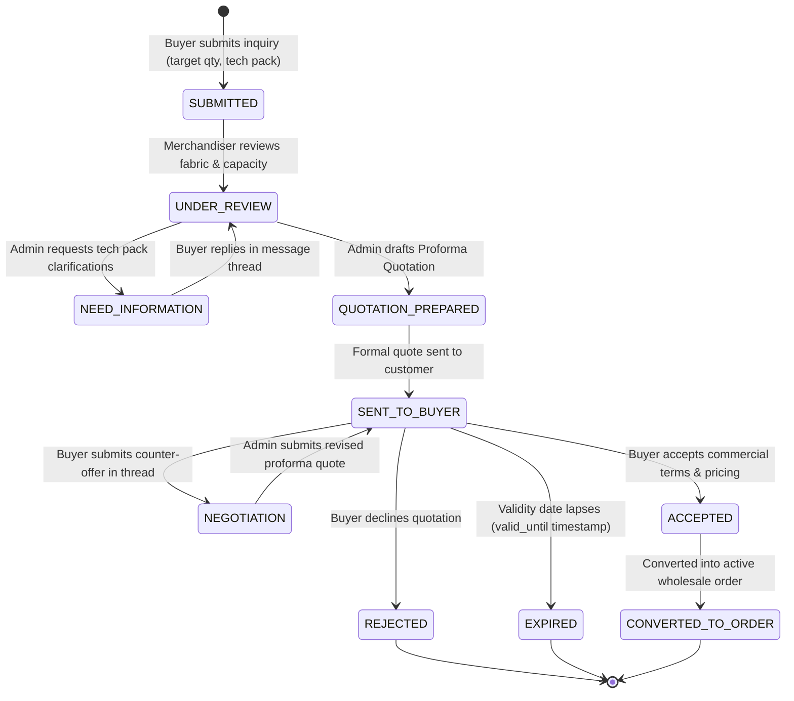

# 06 — Business Rules, Calculations & State Machines

## 1. Core Mathematical Calculations & Formulas

### 1.1 Volume Tier Pricing Formula
Wholesale pricing is dynamically resolved based on total quantity per line item or total order quantity:
$$\text{UnitPrice}(Q) = \begin{cases} 
P_{\text{base}} & \text{if } 1 \le Q < Q_2 \\
P_{\text{tier2}} & \text{if } Q_2 \le Q < Q_3 \\
P_{\text{tier3}} & \text{if } Q \ge Q_3
\end{cases}$$
Where:
- $P_{\text{base}}$ = Default wholesale base price configured on `products.wholesale_price`.
- $P_{\text{tier2}}$, $P_{\text{tier3}}$ = Unit prices retrieved from `product_pricing_tiers` ordered by `min_quantity ASC`.
- In absence of explicit `product_pricing_tiers` rows, automatic discount fallbacks are applied:
  - $P_{\text{tier2}} = P_{\text{base}} \times 0.92$ (8% wholesale volume discount)
  - $P_{\text{tier3}} = P_{\text{base}} \times 0.85$ (15% container load volume discount)

### 1.2 Package Assortment & Complete Carton Calculation (`getMaxCompletePackages`)
Implemented in `backend/app/Models/Product.php@getMaxCompletePackages`:
Wholesale buyers order garments in pre-assorted carton packs (e.g., Pack A: 2×S, 4×M, 4×L, 2×XL). The system prevents broken-ratio cartons by calculating the bottleneck across individual variant warehouse balances:

$$\text{AvailableCartons}_{\text{variant}} = \left\lfloor \frac{\text{Inventory}_{\text{variant}}}{\text{AllocationQuantity}_{\text{variant}}} \right\rfloor$$
$$\text{MaxCompletePackages} = \min_{i \in \text{Allocations}} \left( \text{AvailableCartons}_i \right)$$

*If no specific package allocations are defined, the maximum packages fallback to $\lfloor \text{TotalStock} / \max(1, \text{MOQ}) \rfloor$.*

### 1.3 Full-Stock Clearance Liquidation Formula
When a wholesale buyer opts for **Full-Stock Clearance**, the garment must have `is_full_stock_eligible = true` and positive warehouse balance ($Q_{\text{stock}} > 0$).
$$Q_{\text{order}} = Q_{\text{stock}}$$
$$\text{LineTotal}_{\text{fullstock}} = Q_{\text{stock}} \times P_{\text{fullstock}}$$
Where $P_{\text{fullstock}}$ is strictly capped to protect buyers:
$$P_{\text{fullstock}} = \min(P_{\text{fullstock\_configured}}, P_{\text{tier3}})$$
*Guarantees the liquidation price never exceeds the lowest regular wholesale tier price.*

### 1.4 Volumetric CBM & Carton Specifications
In garment export shipping, freight costs depend on both physical gross weight and volumetric weight (CBM):
$$\text{CBM}_{\text{carton}} = \frac{L_{\text{cm}} \times W_{\text{cm}} \times H_{\text{cm}}}{1{,}000{,}000}$$
$$\text{TotalCartons} = \left\lceil \frac{Q_{\text{order}}}{\text{PiecesPerCarton}} \right\rceil$$
$$\text{TotalCBM} = \text{TotalCartons} \times \text{CBM}_{\text{carton}}$$
$$\text{TotalGrossWeight} = \text{TotalCartons} \times W_{\text{gross\_per\_carton}}$$

### 1.5 Sales, Profit & COGS Formulation
Enforced in `SalesProfitAnalyticsService.php`:
$$\text{COGS}_{\text{order}} = \sum_{i=1}^{n} (Q_i \times \text{buying\_price\_at\_sale}_i)$$
$$\text{GrossProfit}_{\text{order}} = \text{Subtotal}_{\text{order}} - \text{COGS}_{\text{order}}$$
$$\text{GrossMarginPercentage} = \frac{\text{GrossProfit}}{\text{Subtotal}} \times 100$$
> **Crucial Audit Rule**: `buying_price_at_sale` is permanently snapshotted into `order_items` during the checkout transaction. If an administrator later changes a product's cost price in the inventory management view, historical order profitability remains completely immutable.

---

## 2. Order Lifecycle State Machine

The order lifecycle tracks wholesale export commitments through banking verification and international freight dispatch.

### Transition Invariants
1. **`pending` → `confirmed`**: Requires an authenticated administrator user ID. Automatically logs an activity event in `order_status_events` and decrements `inventories.reserved_quantity` while committing the physical stock reduction.
2. **`confirmed` → `processing`**: Order items locked; package allocations finalized.
3. **`processing` → `shipped`**: Requires tracking number or carrier code (e.g., Aramex tracking ID).

---

## 3. B2B RFQ & Commercial Quotation State Machine

For high-volume, custom OEM manufacturing orders, transactions follow the RFQ negotiation cycle with exact uppercase database enums:

### Exact Status Enums in PostgreSQL:
- **`quotes.status`**: `SUBMITTED`, `UNDER_REVIEW`, `NEED_INFORMATION`, `QUOTATION_PREPARED`, `SENT_TO_BUYER`, `NEGOTIATION`, `ACCEPTED`, `REJECTED`, `EXPIRED`, `CONVERTED_TO_ORDER`, `CANCELLED`
- **`quotations.status`**: `DRAFT`, `READY`, `SENT`, `VIEWED`, `NEGOTIATION`, `ACCEPTED`, `REJECTED`, `EXPIRED`, `CONVERTED_TO_ORDER`, `CANCELLED`
