# 12 — Frontend State Management & Data Flow Architecture

## 1. Multi-Layer State Model

The frontend manages data across five distinct state layers depending on lifetime, persistence requirements, and sharing scope:

```
┌────────────────────────────────────────────────────────┐
│ 1. URL State (Query Params & Dynamic Segments)         │  Search, filters, page numbers, tabs
├────────────────────────────────────────────────────────┤
│ 2. Global React Contexts (Session & Basket)            │  Auth, AdminAuth, Cart, Wishlist, RFQ
├────────────────────────────────────────────────────────┤
│ 3. Persistent LocalStorage State                       │  Auth tokens, guest cart items, preferences
├────────────────────────────────────────────────────────┤
│ 4. Transient Component State (useState / useReducer)   │  Form drafts, active tabs, modal toggles
├────────────────────────────────────────────────────────┤
│ 5. Remote Server State (API Service Responses)         │  Products, orders, quotations, analytics
└────────────────────────────────────────────────────────┘
```

---

## 2. State Layer In-Depth

### 2.1 URL State (Shareable Navigation & Filters)
- **Engine**: Next.js `useSearchParams()` and `useRouter()`.
- **Implementation**: `src/app/search/page.tsx` reads and writes state directly to the URL query string:
  - `?search=jeans`
  - `&category=c_denim`
  - `&brand=b_levis`
  - `&audience=MEN`
  - `&design_type=ORIGINAL`
  - `&page=1`
- **Benefit**: Ensures search and filtered catalog states are 100% bookmarkable, shareable between buyers, and SEO-friendly.

### 2.2 Global Context State
1. **`AdminAuthContext` (`src/lib/AdminAuthContext.tsx`)**:
   - Manages `{ adminUser, loading, isAdmin }`.
   - Reads token from `localStorage.getItem("admin_token")`.
   - On load, executes `GET /api/v1/auth/me` to ensure token validity before unlocking the admin dashboard.
2. **`AuthContext` (`src/lib/AuthContext.tsx`)**:
   - Manages customer session `{ user, loading }`.
   - Intercepts 401 unauthenticated errors and dispatches `ayaan:session-expired`.
3. **`CartContext` (`src/lib/CartContext.tsx`)**:
   - Manages `{ items, subtotal, totalQuantity, coupon, isFullStock }`.
   - Automatically re-evaluates 3-tier wholesale prices as quantities increment across tier breaks.

### 2.3 Persistent LocalStorage State
- `admin_token`: Bearer token for administrative sessions.
- `customer_token`: Bearer token for customer sessions.
- `ayaan_cart`: LocalStorage backup of customer bag for guest browsing.
- `ayaan_wishlist`: Array of saved product IDs.

---

## 3. Component Data Flow Pattern

All data acquisition and mutations follow a strict unidirectional pipeline:

```mermaid
flowchart LR
    Component["UI Component\n(e.g., ShopByBrand)"] --> Hook["Context / Hook\n(useContext / useEffect)"]
    Hook --> Service["Typed Service\n(brand.service.ts)"]
    Service --> ApiClient["Central Client\n(api-client.ts)"]
    ApiClient --> Network["HTTP Request\n(:8000/api/v1/*)"]
    Network --> Response["JSON Response"]
    Response --> Normalizer["Type Normalization & Safety"]
    Normalizer --> StateSet["setState(data)"]
    StateSet --> Render["DOM Re-render"]
```



### 3.1 Debouncing in Search
In `src/components/layout/Header.tsx`, search input changes are debounced by 300ms before calling `SearchController::suggestions` to avoid saturating the network on rapid keystrokes.

### 3.2 Optimistic Updates in Wishlist & Cart
When a buyer clicks "Heart" on a `ProductCard`, `WishlistContext` optimistically adds the item to the local wishlist state immediately for 0ms visual feedback, then calls `POST /api/v1/wishlist/items` in the background. If the request fails, state rolls back and an error toast appears.
