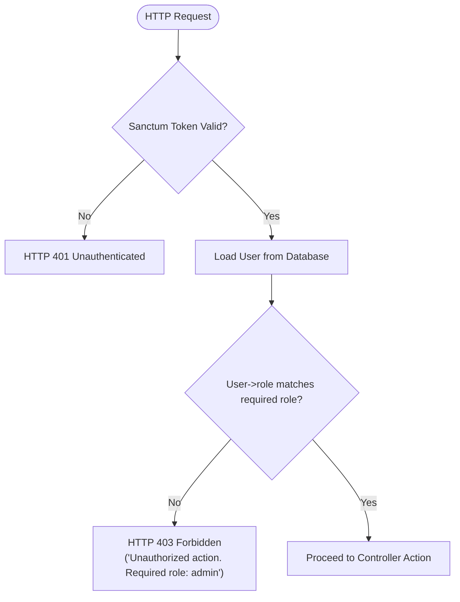

# 15 — Authentication & Authorization Architecture

## 1. Authentication Engine: Laravel Sanctum

Authentication in Ayaan Clothing is state-less and token-based, powered by **Laravel Sanctum** (`^4.0`).
- **Token Mechanism**: When a user registers or logs in via `/api/v1/auth/login`, Sanctum generates a cryptographically secure SHA-256 hashed Personal Access Token stored in the `personal_access_tokens` table.
- **Client Transmission**: The client receives plain-text token string (e.g., `42|AbCdEf...`) and transmits it on all subsequent requests in the HTTP Authorization header:
  `Authorization: Bearer 42|AbCdEf...`
- **Revocation**: On logout (`POST /api/v1/auth/logout`), Sanctum deletes the current token from `personal_access_tokens`, immediately terminating that device's session.

---

## 2. Two-Role Authorization Architecture

The platform defines exactly two mutually exclusive roles enforced in the `users` database table via PostgreSQL check constraint:

```sql
ALTER TABLE users ADD CONSTRAINT check_user_role CHECK (role IN ('admin', 'customer'));
```

| Role | Intended User | Privileges & Boundaries |
|---|---|---|
| **`customer`** | B2B Garment Buyer / Importer | Can browse catalog, place orders, upload payment slips, submit RFQs, negotiate quotes, and manage company delivery addresses. Strictly blocked from `/api/v1/admin/*`. |
| **`admin`** | Internal Merchandiser / Superuser | Full access to product catalog CRUD, brand/category taxonomies, homepage merchandising, warehouse inventory adjustments, order review, payment verification, and financial analytics. |

---

## 3. Client-Side Token Isolation & Storage Keys

Verified against `src/services/api-client.ts`:

1. **Customer Token Storage**:
   - Stored in browser `localStorage.getItem("ayaan_auth_token")`.
   - Handled via `AuthContext.tsx`.
2. **Admin Token Storage**:
   - Stored in browser `localStorage.getItem("ayaan_admin_token")`.
   - Handled via `AdminAuthContext.tsx`.
3. **Session ID Accumulation**:
   - Stored in browser `localStorage.getItem("ayaan_session_id")` and sent via `X-Session-Id` header for anonymous cart tracking.
4. **Automatic Context Resolution**:
   - If `apiClient.isAdminContext()` evaluates to `true` (port `3001`, path `/admin/*`, or `admin.*` subdomain), `apiClient.getToken()` retrieves `ayaan_admin_token`.
   - In storefront customer context, it retrieves `ayaan_auth_token`.
5. **Session Expiry Handling**:
   - A `401 Unauthorized` response triggers a single revalidation attempt before firing the `ayaan:session_expired` custom event.
   - Non-401 errors (403, 404, 429, 500) **never** clear stored tokens.

---

## 4. Role Enforcement Middleware (`EnsureUserHasRole.php`)

All administrative routes are protected by chained Sanctum and role middleware:
`Route::middleware(['auth:sanctum', 'role:admin'])->group(...)`



### Exact Middleware Source (`backend/app/Http/Middleware/EnsureUserHasRole.php`):
```php
if (! empty($roles) && ! in_array($user->role, $roles, true)) {
    return response()->json([
        'success' => false,
        'message' => 'Unauthorized action. Required role: ' . implode(' or ', $roles),
    ], Response::HTTP_FORBIDDEN);
}
```

---

## 5. Security & Brute-Force Hardening

1. **Password Hashing**: Passwords are encrypted using PHP native Bcrypt with work factor 12 (`BCRYPT_ROUNDS=12` in config).
2. **Rate Limiting (Throttle Middleware)**:
   - `throttle:auth-login`: Maximum 5 attempts per minute per IP address and email combination. Exceeding triggers `HTTP 429 Too Many Requests`.
   - `throttle:auth-register`: Maximum 10 registrations per minute per IP address.
   - `throttle:password-reset`: Maximum 5 requests per minute.
   - `throttle:checkout-order`: Rate limits order placement and checkout validation.
   - `throttle:rfq-create`: Rate limits quotation requests.
3. **Timing-Attack Resistance**: Authentication verifies credentials using constant-time string comparisons (`Hash::check`).
4. **CORS Policy (`backend/config/cors.php`)**:
   - Rejects wildcard `*` origins on credentialed requests.
   - Authorizes strictly `http://localhost:3000` and `http://localhost:3001` in local dev (and `https://ayaanclothing.com`, `https://admin.ayaanclothing.com` in production).
