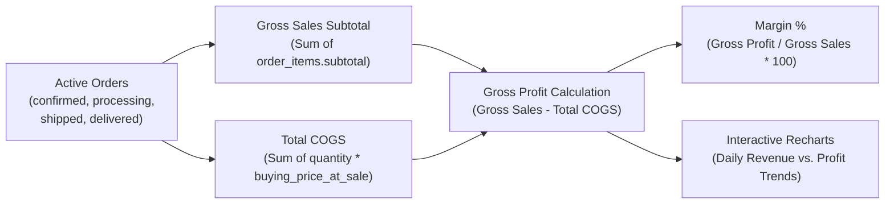

# 30 — Analytics, Financial Intelligence & Tracking

This document details internal financial intelligence, sales analytics, audit tracking, and web telemetry.

---

## 1. Internal Financial Profitability Analytics

Unlike standard retail platforms that only report top-line revenue, Ayaan Clothing implements a dedicated **Cost of Goods Sold (COGS) and Gross Margin** intelligence engine:
- **Service**: `backend/app/Services/Analytics/SalesProfitAnalyticsService.php`.
- **API Endpoint**: `GET /api/v1/admin/analytics/sales-profit`.
- **Frontend Dashboard**: `src/components/admin/dashboard/SalesProfitOverview.tsx` (rendered on `/admin` via Recharts).

### Metrics Computed:
1. **Total Gross Sales**: Aggregate wholesale invoice totals.
2. **Total Cost of Goods Sold (COGS)**: Sum of manufacturing buying prices recorded at sale time.
3. **Net Gross Profit**: Gross Sales minus COGS.
4. **Profit Margin %**: Ratio of gross profit to revenue.
5. **Average Order Value (AOV)**: Mean dollar value across completed orders.
6. **Order Pipeline Breakdown**: Real-time count of orders in `pending_payment`, `payment_verification_pending`, `confirmed`, `processing`, and `shipped`.

---

## 2. Order Milestone & Logistics Tracking

Every order lifecycle event is tracked immutably in the `order_status_events` table:
- **Captured Data**: `order_id`, `status_from`, `status_to`, `user_id` (who executed change), `notes`, `created_at`.
- **Carrier Waybill Tracking**:
  - Endpoint: `GET /api/v1/orders/{id}/tracking`.
  - Communicates with Aramex shipping API to retrieve real-time air cargo milestones (e.g., "Departed Dhaka Hub", "Cleared Customs", "Out for Delivery").

---

## 3. Web Telemetry & External Analytics Hooks

- **Google Tag Manager / GA4**: Prepared via standard script injection hooks in `src/app/layout.tsx`.
- **Privacy & Cookie Compliance**: The platform utilizes functional session cookies and local storage tokens without third-party tracking scripts, ensuring GDPR and international enterprise privacy compliance.
