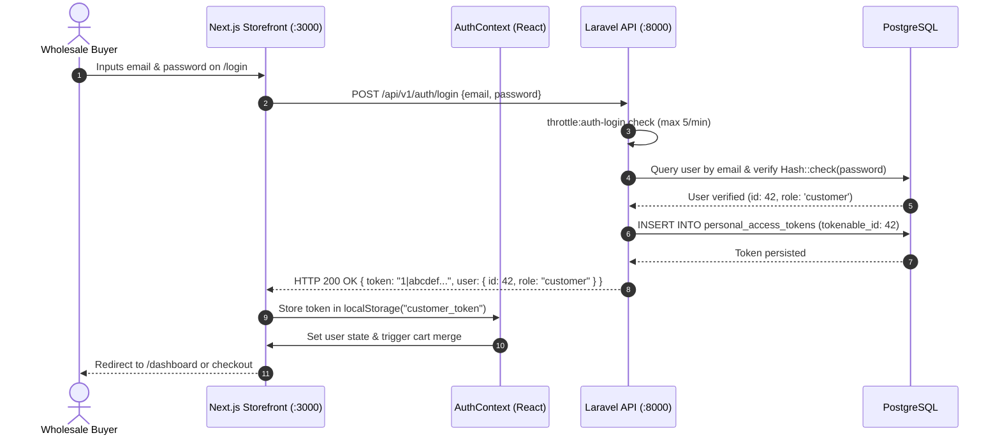
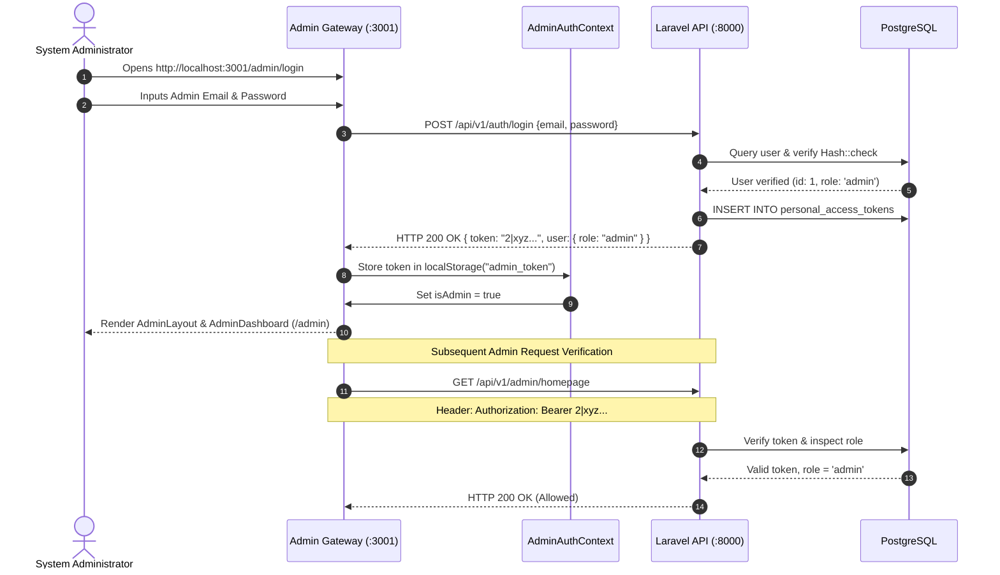
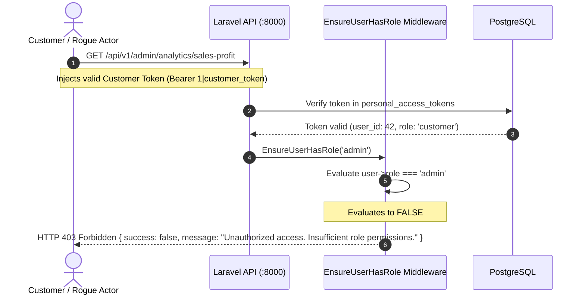

# Authentication & Authorization Flow Diagrams

This document details the exact sequence of token generation, storage, header transmission, and role authorization.

---

## 1. Customer Authentication Flow

---

## 2. Admin Authentication & Session Verification Flow

---

## 3. Customer Unauthorized Privilege Escalation Prevention

