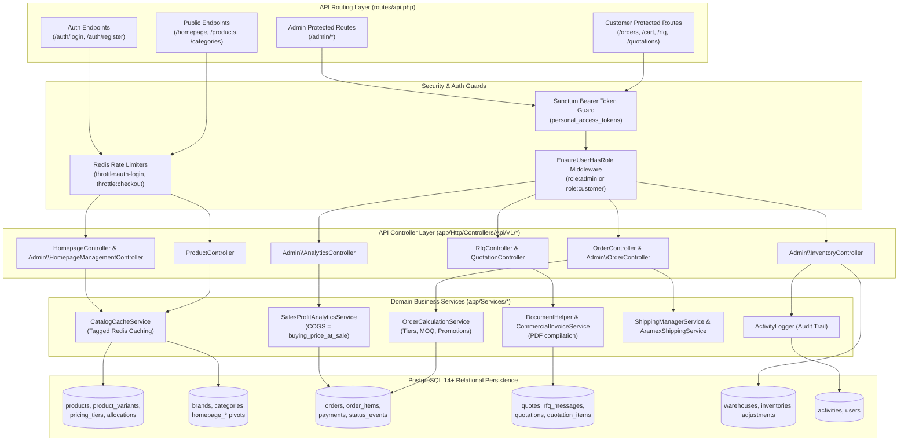

# Backend Architecture Diagrams

This document visualizes the internal component architecture of the Laravel 13 REST API backend.

---

## 1. Controller, Service, and Repository Mapping

```mermaid
graph TD
    subgraph Ingress ["API Routing Layer (routes/api.php)"]
        PublicRoutes["Public Endpoints\n(/homepage, /products, /categories)"]
        AuthRoutes["Auth Endpoints\n(/auth/login, /auth/register)"]
        CustomerRoutes["Customer Protected Routes\n(/orders, /cart, /rfq, /quotations)"]
        AdminRoutes["Admin Protected Routes\n(/admin/*)"]
    end

    subgraph Security ["Security & Auth Guards"]
        Throttle["Redis Rate Limiters\n(throttle:auth-login, throttle:checkout)"]
        SanctumGuard["Sanctum Bearer Token Guard\n(personal_access_tokens)"]
        RoleMiddleware["EnsureUserHasRole Middleware\n(role:admin or role:customer)"]
    end

    subgraph Controllers ["API Controller Layer (app/Http/Controllers/Api/V1/*)"]
        ProdCtrl["ProductController"]
        HomeCtrl["HomepageController & Admin\\HomepageManagementController"]
        OrdCtrl["OrderController & Admin\\OrderController"]
        RfqCtrl["RfqController & QuotationController"]
        InvCtrl["Admin\\InventoryController"]
        AnalyticsCtrl["Admin\\AnalyticsController"]
    end

    subgraph Services ["Domain Business Services (app/Services/*)"]
        OrderCalc["OrderCalculationService\n(Tiers, MOQ, Promotions)"]
        CatCache["CatalogCacheService\n(Tagged Redis Caching)"]
        ProfitAnalytics["SalesProfitAnalyticsService\n(COGS = buying_price_at_sale)"]
        DocGenerator["DocumentHelper & CommercialInvoiceService\n(PDF compilation)"]
        ShippingMgr["ShippingManagerService & AramexShippingService"]
        ActivityLogger["ActivityLogger (Audit Trail)"]
    end

    subgraph Persistence ["PostgreSQL 14+ Relational Persistence"]
        DBProducts[("products, product_variants,\npricing_tiers, allocations")]
        DBTaxonomies[("brands, categories,\nhomepage_* pivots")]
        DBOrders[("orders, order_items,\npayments, status_events")]
        DBB2B[("quotes, rfq_messages,\nquotations, quotation_items")]
        DBInventory[("warehouses, inventories,\nadjustments")]
        DBAudit[("activities, users")]
    end

    PublicRoutes --> Throttle
    AuthRoutes --> Throttle
    CustomerRoutes --> SanctumGuard
    AdminRoutes --> SanctumGuard

    SanctumGuard --> RoleMiddleware
    Throttle --> ProdCtrl
    Throttle --> HomeCtrl
    RoleMiddleware --> OrdCtrl
    RoleMiddleware --> RfqCtrl
    RoleMiddleware --> InvCtrl
    RoleMiddleware --> AnalyticsCtrl

    ProdCtrl --> CatCache
    HomeCtrl --> CatCache
    OrdCtrl --> OrderCalc
    OrdCtrl --> ShippingMgr
    RfqCtrl --> DocGenerator
    AnalyticsCtrl --> ProfitAnalytics
    InvCtrl --> ActivityLogger

    CatCache --> DBTaxonomies
    CatCache --> DBProducts
    OrderCalc --> DBOrders
    ProfitAnalytics --> DBOrders
    DocGenerator --> DBB2B
    InvCtrl --> DBInventory
    ActivityLogger --> DBAudit
```
