# Database Entity-Relationship Diagram (ERD)

This document visualizes the complete entity-relationship model of PostgreSQL (`ayaan_db`), detailing foreign key cardinalities, associations, and key attributes across all 34 models and 49 migrations.

---

## 1. Complete Relational ERD

```mermaid
erDiagram
    users ||--o{ orders : "places"
    users ||--o{ addresses : "owns"
    users ||--o{ quotes : "submits"
    users ||--o{ quotations : "receives"
    users ||--o{ activities : "generates"
    users ||--o{ carts : "owns"
    users ||--o| wishlists : "saves"
    users ||--o{ personal_access_tokens : "authenticates_via"

    brands ||--o{ products : "manufactures"
    brands ||--o| homepage_featured_brands : "featured_in"

    categories ||--o{ category_product : "maps"
    categories ||--o| homepage_hot_sale_categories : "spotlighted_in"
    categories ||--o{ categories : "sub_categorizes"

    products ||--o{ category_product : "categorized_in"
    products ||--o{ product_variants : "has"
    products ||--o{ product_images : "showcases"
    products ||--o{ product_pricing_tiers : "prices_via"
    products ||--o{ product_package_allocations : "packs_in"
    products ||--o{ product_shipping_package_profiles : "ships_in"
    products ||--o{ inventories : "stocked_at"
    products ||--o{ cart_items : "added_to"
    products ||--o{ wishlist_items : "saved_in"
    products ||--o{ order_items : "purchased_in"
    products ||--o| homepage_featured_products : "featured_in"

    warehouses ||--o{ inventories : "holds"
    inventories ||--o{ admin_inventory_adjustments : "audited_in"

    carts ||--o{ cart_items : "contains"
    wishlists ||--o{ wishlist_items : "contains"

    orders ||--o{ order_items : "contains"
    orders ||--o{ order_status_events : "transitions_via"
    orders ||--o{ payments : "paid_by"
    quotations ||--o| orders : "converts_to"

    quotes ||--o{ quote_items : "contains"
    quotes ||--o{ rfq_messages : "negotiates_via"
    quotes ||--o{ quotations : "results_in"
    quotations ||--o{ quotation_items : "contains"

    users {
        bigint id PK
        string name
        string email UK
        string password
        string role
        string company_name
        string phone
        string tax_id
        string b2b_approval_status
        string b2b_payment_terms
        numeric b2b_credit_limit
        boolean is_demo
    }

    products {
        bigint id PK
        bigint brand_id FK
        string name
        string slug UK
        string sku UK
        string audience
        string design_type
        numeric wholesale_price
        numeric msrp_price
        numeric cost_price
        integer moq
        numeric full_stock_price
        string status
        boolean is_featured
        integer featured_sort_order
        boolean is_demo
    }

    brands {
        bigint id PK
        string name
        string slug UK
        string logo_url
        boolean is_active
        boolean is_featured_on_landing
        integer landing_sort_order
    }

    categories {
        bigint id PK
        bigint parent_id FK
        string name
        string slug UK
        string image_url
        boolean is_active
        boolean is_featured_on_landing
        integer landing_sort_order
    }

    product_variants {
        bigint id PK
        bigint product_id FK
        string sku UK
        string color
        string size
        numeric price_modifier
        boolean is_active
    }

    product_pricing_tiers {
        bigint id PK
        bigint product_id FK
        integer min_quantity
        integer max_quantity
        numeric unit_price
    }

    product_package_allocations {
        bigint id PK
        bigint product_id FK
        bigint product_variant_id FK
        string package_name
        string color
        string size
        integer quantity
    }

    product_shipping_package_profiles {
        bigint id PK
        bigint product_id FK
        integer package_quantity
        integer carton_count
        numeric carton_length
        numeric carton_width
        numeric carton_height
        numeric gross_weight
        string dimension_unit
        string weight_unit
    }

    inventories {
        bigint id PK
        bigint product_id FK
        bigint warehouse_id FK
        integer available_quantity
        integer reserved_quantity
    }

    warehouses {
        bigint id PK
        string name
        string code UK
        string city
        string country
        boolean is_active
    }

    carts {
        bigint id PK
        bigint user_id FK
        string session_id
        string status
    }

    cart_items {
        bigint id PK
        bigint cart_id FK
        bigint product_id FK
        bigint product_variant_id FK
        string size
        integer quantity
        jsonb package_breakdown
    }

    orders {
        bigint id PK
        string order_number UK
        bigint user_id FK
        string status
        string payment_status
        string fulfillment_status
        numeric subtotal
        numeric shipping_cost
        numeric tax_amount
        numeric discount_amount
        numeric other_charges
        numeric total_amount
        string payment_method
        string carrier
        string tracking_number
        jsonb shipping_snapshot
        jsonb payment_details
    }

    order_items {
        bigint id PK
        bigint order_id FK
        bigint product_id FK
        bigint product_variant_id FK
        string product_name
        string sku
        string size
        string color
        numeric unit_price
        integer quantity
        numeric line_total
        numeric buying_price_at_sale
        jsonb package_breakdown
    }

    payments {
        bigint id PK
        bigint order_id FK
        bigint customer_id FK
        numeric amount
        string status
        string payment_method
        string payer_name
        string bank_name
        string account_number
        string receipt_url
        string receipt_path
        timestamp submitted_at
        timestamp confirmed_at
    }

    quotes {
        bigint id PK
        string rfq_number UK
        bigint user_id FK
        string buyer_name
        string buyer_email
        string company_name
        string destination_country
        string status
    }

    quote_items {
        bigint id PK
        bigint quote_id FK
        bigint product_id FK
        string product_name
        integer quantity
        numeric unit_price
        numeric target_price
    }

    rfq_messages {
        bigint id PK
        bigint quote_id FK
        bigint user_id FK
        string sender_role
        string sender_name
        text message
        timestamp read_at
    }

    quotations {
        bigint id PK
        string quotation_number UK
        integer revision_number
        bigint quote_id FK
        bigint user_id FK
        string buyer_name
        string company_name
        numeric subtotal
        numeric grand_total
        string payment_terms
        string shipping_terms
        string status
        timestamp valid_until
        bigint converted_order_id FK
    }

    quotation_items {
        bigint id PK
        bigint quotation_id FK
        bigint product_id FK
        string product_name
        integer quantity
        numeric unit_price
        numeric line_total
    }
```

