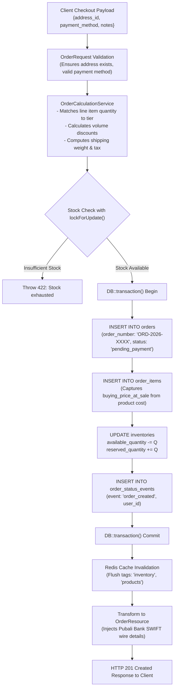
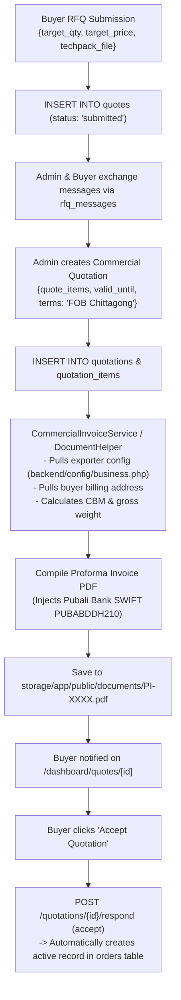

# Data Flow Diagrams

This document maps data flows from client input through validation, transformation, domain services, database mutation, and side effects.

---

## 1. Wholesale Checkout & Order Booking Data Flow

---

## 2. RFQ to Proforma Invoice Document Generation Data Flow

