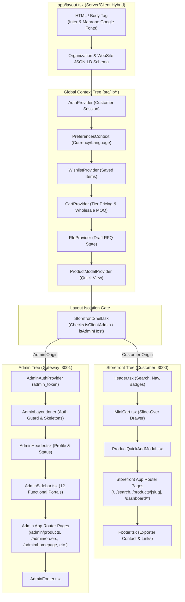
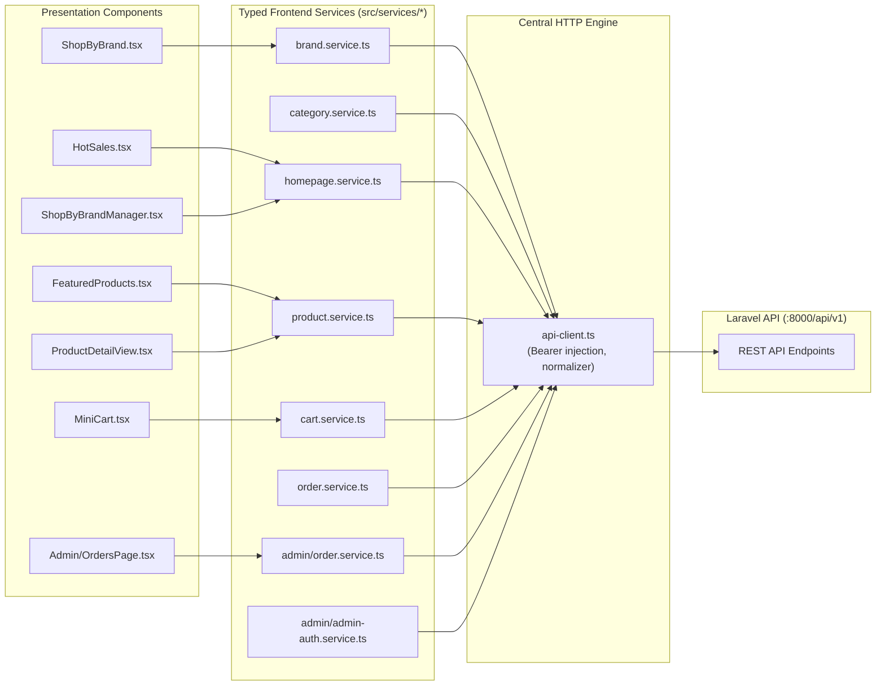

# Frontend Architecture Diagrams

This document visualizes the Next.js component hierarchy, Context Provider nesting, and API client dependencies.

---

## 1. Provider Tree & Layout Gate Architecture

---

## 2. API Service Consumption & Component Mapping

