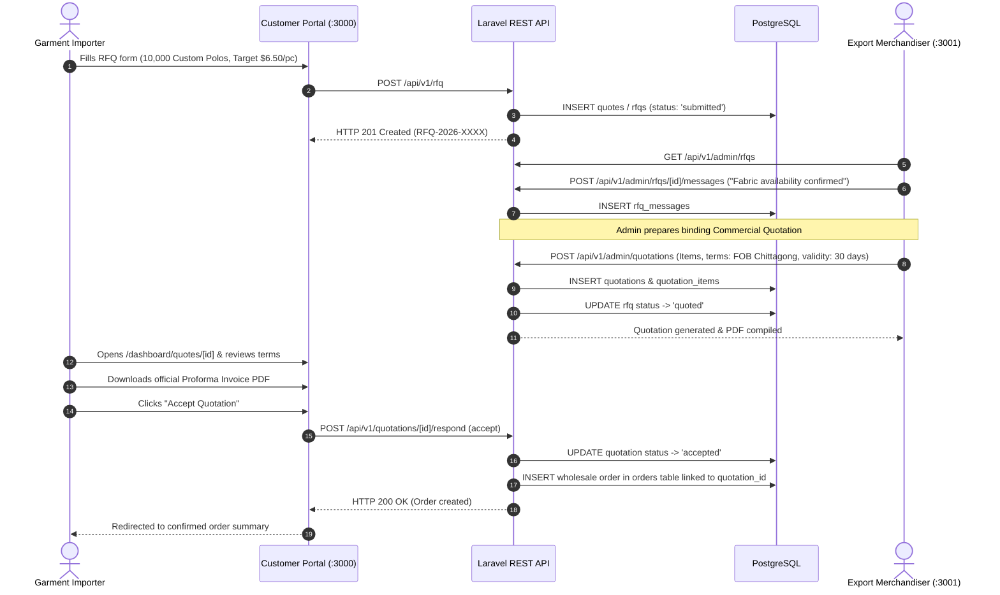
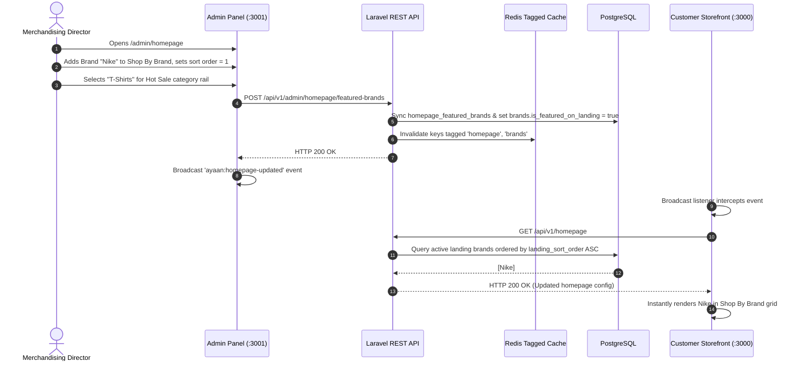

# Major User Flow Diagrams

This document illustrates the major interaction flows between Users, Frontend components, Backend controllers, and the PostgreSQL database.

---

## 1. Wholesale Checkout & Payment Proof Verification Flow

```mermaid
sequenceDiagram
    autonumber
    actor Buyer as Wholesale Buyer
    participant Frontend as Next.js Storefront (:3000)
    participant Api as Laravel API (:8000)
    participant DB as PostgreSQL
    actor Admin as Merchandising Admin (:3001)

    Buyer->>Frontend: Adds 100 units to Cart (Tier 3 wholesale rate applied)
    Buyer->>Frontend: Submits Checkout with "Bank Wire Transfer"
    Frontend->>Api: POST /api/v1/orders
    Api->>DB: INSERT order (status: 'pending_payment')
    Api->>DB: Lock & reserve inventory in inventories table
    Api-->>Frontend: HTTP 201 Created (ORD-2026-XXXX)
    Frontend-->>Buyer: Shows Pubali Bank wire details (SWIFT PUBABDDH210)

    note over Buyer,Frontend: Buyer executes wire at bank & receives deposit receipt

    Buyer->>Frontend: Uploads receipt image on /dashboard/orders/[id]
    Frontend->>Api: POST /api/v1/orders/[id]/payment-proof
    Api->>DB: INSERT payment record (status: 'pending_review')
    Api->>DB: UPDATE order status -> 'payment_verification_pending'
    Api-->>Frontend: HTTP 200 OK (Receipt uploaded)

    note over Admin,Api: Admin reviews order in /admin/orders

    Admin->>Api: GET /api/v1/admin/orders/[id]
    Api-->>Admin: Returns order details & receipt image URL
    Admin->>Admin: Inspects deposit slip & matches bank transaction
    Admin->>Api: POST /api/v1/admin/orders/[id]/payment-proof/review (approve)
    Api->>DB: UPDATE payment status -> 'completed'
    Api->>DB: UPDATE order status -> 'confirmed'
    Api->>DB: Commit physical stock decrement in inventories
    Api->>DB: INSERT order_status_events ('payment_verified')
    Api-->>Admin: HTTP 200 OK (Order confirmed)
    Admin-->>Buyer: Order confirmed; factory begins carton packing
```

---

## 2. RFQ Negotiation & Commercial Quotation Acceptance Flow



---

## 3. Dynamic Merchandising Synchronization Flow


