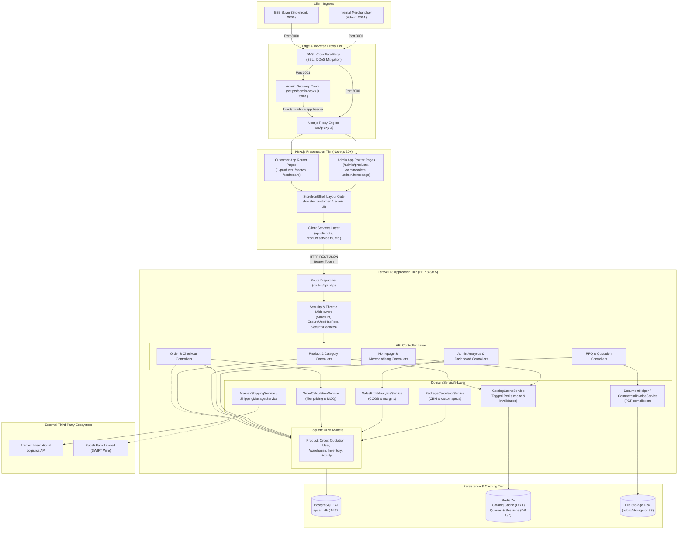
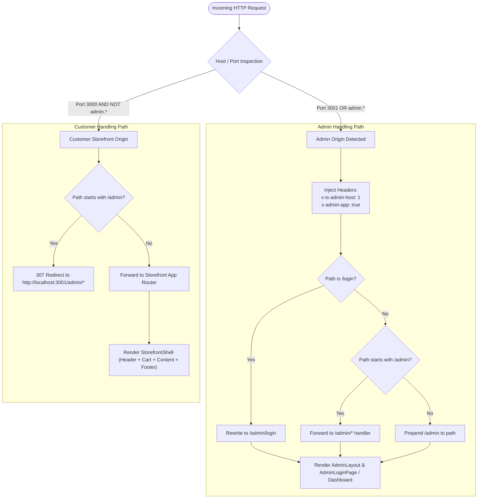
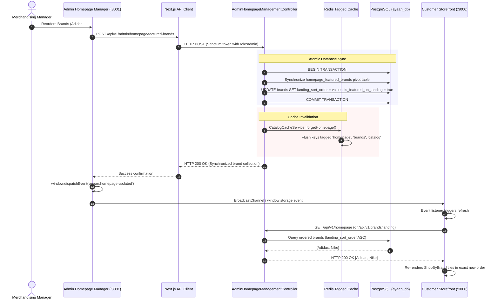

# System Architecture Diagrams

This document visualizes the complete system architecture, deployment topology, and inter-service relationships of the Ayaan Clothing platform.

---

## 1. Complete Physical & Logical Architecture

---

## 2. Admin vs. Customer Network Routing Isolation

The following diagram details how requests to the same underlying Next.js server instance are separated to prevent admin UI leakage into customer storefronts and vice-versa.

---

## 3. Dynamic Catalog Synchronization Architecture

This diagram visualizes how changes in the Admin Merchandising panel propagate immediately to PostgreSQL, invalidate Redis caches, and update Storefront subscribers via browser events without hardcoded arrays.

